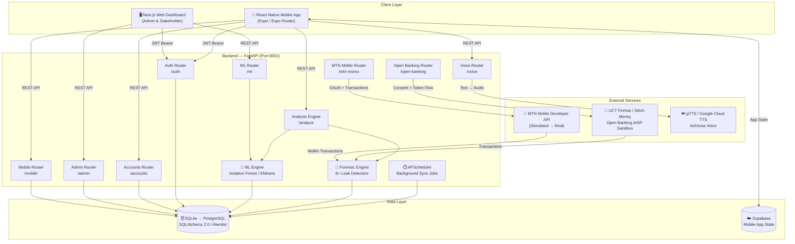
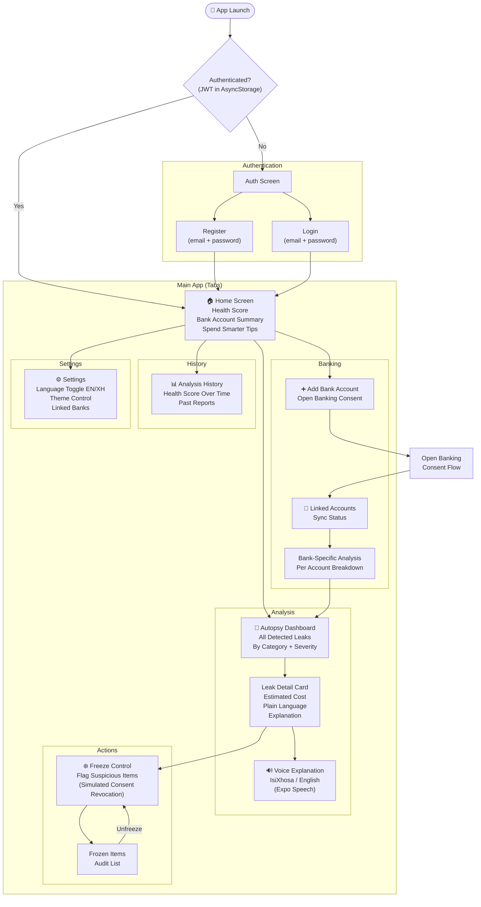
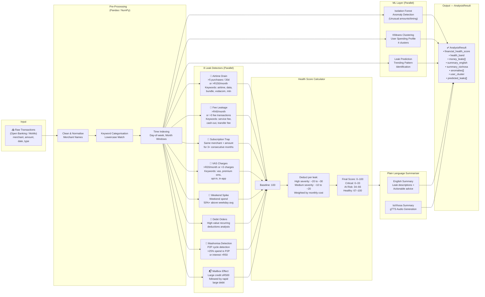
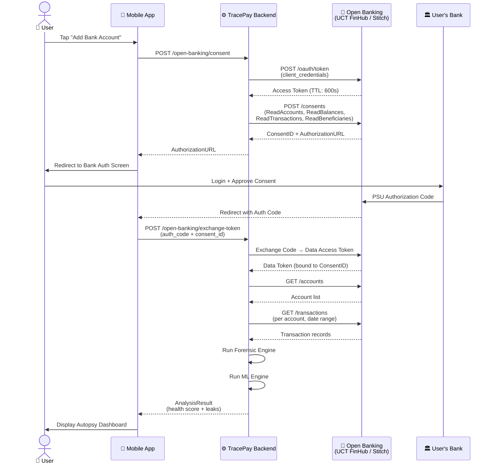
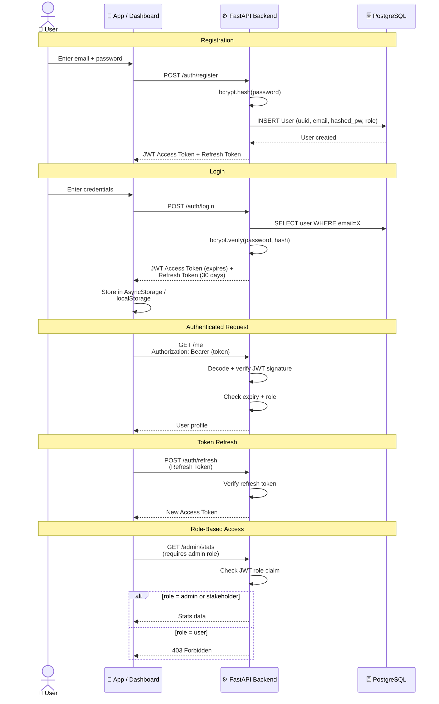
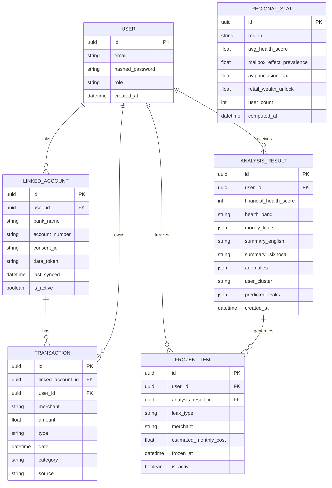
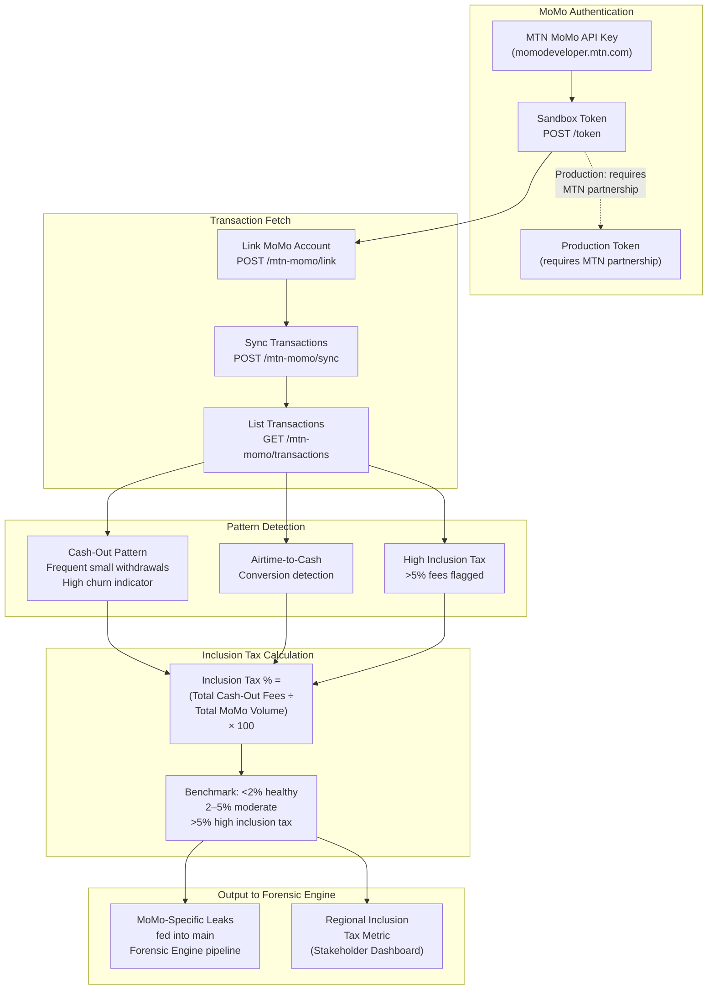
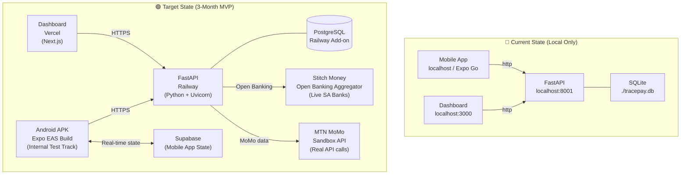

# TracePay — System Diagrams

---

## 1. Overall System Architecture

---

## 2. Mobile App — Screen Flow & Navigation

---

## 3. Web Dashboard — Page Structure & Data Sources

```mermaid
flowchart TD
    DashLogin["🔐 Dashboard Login\n(Admin / Stakeholder JWT)"]

    subgraph Overview["Overview Page — /dashboard"]
        Stats["Platform Statistics\n• Total Users\n• Active Users\n• Linked Accounts\n• Total Transactions\n• Avg Health Score\n• Total Frozen Items\n• Capital Protected\n• ML Anomalies Detected\n• Mailbox Effect Prevalence\n• Retail Wealth Unlock"]
    end

    subgraph MLReports["ML Reports — /dashboard/ml-reports"]
        AnomalyDist["Anomaly Distribution\nHigh / Medium / Low Risk\n(ApexCharts)"]
        LeakCats["Top Leak Categories\n+ Growth Trends"]
        PredSavings["Predicted Savings\nOpportunities"]
        UserProfiles["User Cluster Profiles\nfrequent_small / high_value\nmoderate / infrequent"]
    end

    subgraph Regional["Regional Insights — /dashboard/regional"]
        HeatMap["🗺️ Leaflet Heat Map\nEC District Municipalities\nHealth Score Overlay"]
        LeakPrev["Leak Prevalence\nBy Region + Category"]
        UserDist["User Distribution\nGeographic Spread"]
        InclusionTax["MTN MoMo Inclusion Tax\nBy Region"]
    end

    subgraph UserMgmt["User Management — /dashboard/users"]
        UserList["Paginated User List\n(Admin View)"]
        UserDetail["User Analysis History\nHealth Score Timeline"]
        RoleView["User Roles\nuser / admin / stakeholder"]
    end

    subgraph DataLog["Data Log — /dashboard/data-log"]
        TxLog["Transaction Audit Trail"]
        AnalysisLog["Analysis Result Log"]
        ActivityLog["User Activity Log"]
        ComplianceDoc["Compliance Records"]
    end

    subgraph Compliance["Compliance — /dashboard/compliance"]
        SARB["SARB Directive No. 2 of 2024\nAlignment Statement"]
        POPIA["POPIA Compliance\nData Protection"]
        OBRules["Open Banking Rules\nThird-Party Access"]
        ConsentMgmt["Consent Management\nGDPR / POPIA Aligned"]
    end

    subgraph Methodology["Methodology — /dashboard/methodology"]
        DetectorDocs["Leak Detector\nAlgorithm Documentation"]
        ScoringDocs["Health Score\nCalculation Methodology"]
        RegionalDocs["Regional Analytics\nAggregation Method"]
    end

    DashLogin --> Overview
    Overview --> MLReports
    Overview --> Regional
    Overview --> UserMgmt
    Overview --> DataLog
    Overview --> Compliance
    Overview --> Methodology

    MLReports --> AnomalyDist & LeakCats & PredSavings & UserProfiles
    Regional --> HeatMap & LeakPrev & UserDist & InclusionTax
    UserMgmt --> UserList --> UserDetail
    UserMgmt --> RoleView
    DataLog --> TxLog & AnalysisLog & ActivityLog & ComplianceDoc
    Compliance --> SARB & POPIA & OBRules & ConsentMgmt
    Methodology --> DetectorDocs & ScoringDocs & RegionalDocs
```

---

## 4. Forensic Engine — Transaction Analysis Pipeline

---

## 5. Open Banking — Consent & Data Access Flow

---

## 6. Authentication Flow — JWT Lifecycle

---

## 7. Data Model — Entity Relationships

---

## 8. MTN MoMo — Integration Flow & Inclusion Tax Calculation

---

## 9. Deployment Architecture — Current vs Target

